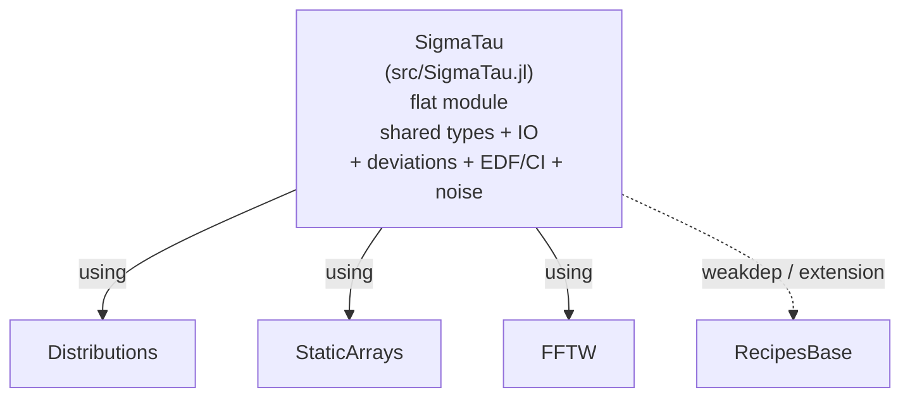

# SigmaTau.jl — Project Overview

> **Last Updated**: 2026-05-21 (v0.3.0 cut).
> **Scope**: Single registerable Julia 1.11 package, flat module —
> deviation kernels, noise identification, EDF/CI, calibrated noise
> generation, and file IO for time-and-frequency stability analysis.

For clock state-space estimation and Kalman steering, see the sister
package [ClockEnsemble.jl](https://github.com/ianlap/ClockEnsemble.jl)
(formerly the `SigmaTau.Est` submodule).

---

## 1. Package Layout



A `docs/` subproject (Documenter.jl) develops `SigmaTau` as a single
path dep; its environment is independent of the package environment.
Source material lifted from the previous cross-language rendition lives
gitignored under `legdocs/`.

Single-package wiring: the root `Project.toml` declares one package
with a small `[deps]` (no `[workspace]`, no `[sources]`, no
submodules). Every public symbol is exported directly from `SigmaTau`
so user code is just `using SigmaTau; adev(...)`.

---

## 2. Per-Component Status

### 2.1 Shared Types

| Component | File | Notes |
|-----------|------|-------|
| `PhaseData{T}` | [src/types/phase_data.jl](src/types/phase_data.jl) | Parametric on `T<:AbstractFloat` |
| `FrequencyData{T}` | [src/types/frequency_data.jl](src/types/frequency_data.jl) | Parametric; wired into every Stab dispatch |
| `StabilityResult` | [src/types/stability_result.jl](src/types/stability_result.jl) | Non-parametric `Vector{Float64}` fields; includes `edf` (empty when `calc_ci=false`) |
| `AbstractTimingData` | [src/types/abstract.jl](src/types/abstract.jl) | Abstract supertype |

### 2.2 Stability Surface

#### Core Kernels

| Kernel | File | Notes |
|--------|------|-------|
| `_adev_core`, `_mdev_core`, `_tdev_core` | [src/stab/core/allan.jl](src/stab/core/allan.jl) | Overlapping ADEV / MDEV / TDEV |
| `_hdev_core`, `_mhdev_core` | [src/stab/core/hadamard.jl](src/stab/core/hadamard.jl) | Hadamard family |
| `_totdev_core`, `_mtotdev_core`, `_htotdev_core`, `_mhtotdev_core` | [src/stab/core/total.jl](src/stab/core/total.jl) | Boundary-extended; threaded |
| `_mtie_core` | [src/stab/core/mtie.jl](src/stab/core/mtie.jl) | O(N) monotonic-deque sliding window; ITU-T G.810 |
| `_pdev_core` | [src/stab/core/pdev.jl](src/stab/core/pdev.jl) | Vernotte 2016/2020; allantools formula parity |

#### Noise Identification

| Component | File | Notes |
|-----------|------|-------|
| `identify_noise` | [src/stab/noise/lag1.jl](src/stab/noise/lag1.jl) | lag-1 ACF + B1/R(n) fallback |
| `_noise_id_lag1acf` | same | Quadratic detrend, differencing, ρ threshold |
| `_noise_id_b1rn` | same | B1-ratio with R(n) WPM/FLPM disambiguation |
| `NEFF_RELIABLE = 30` | same | Per legacy GEMINI.md §2 mandate; boundary test added |
| Preprocessing | same | 5σ outlier rejection (per-record); per-m quadratic detrend opt-in via `detrend=true` |
| Power-law synthesis (internal `_gen_powerlaw_y` / `_gen_powerlaw_phase`) | [src/stab/noise/synth.jl](src/stab/noise/synth.jl) | f^(α/2) shaping for α ∈ {2, 1, 0, -1, -2} |
| `noise_gen` (public, calibrated) | [src/stab/noise/gen.jl](src/stab/noise/gen.jl) | Composite α-mixture; input mode `sigma1[α]=σ_y(τ₀)` or `h[α]=h_α`; returns `PhaseData` or `FrequencyData` |

#### Statistics (EDF / CI / Bias)

| Component | File | Notes |
|-----------|------|-------|
| `calculate_edf` | [src/stab/stats/edf.jl](src/stab/stats/edf.jl) | Full Greenhall/Riley `_compute_sz/_sx/_sw` |
| `confidence_intervals` | same | `Distributions.jl` for χ² + Normal |
| `bias_correction` | same | SP1065 variance-ratio B; callers apply `σ ← σ/√B`. totvar / mtot / htot covered; mhtot has no published model |
| `_coeff_totvar` | same | ADEV-style EDF fallback for α=2,1; published values for α∈{0,-1,-2} |
| `_coeff_htot` | same | FCS 2001 / Howe & Tasset 2005 Table I `(b₀, b₁)` for α∈{0,-1,-2,-3,-4}; matches Stable32 EDF to <0.01% for `τ ≥ 16τ₀` |
| `_coeff_mtot` | same | α=0 two-AF fit to Stable32 `(1.330, 1.890)`; α=−1, α=−2 single-point fits with `c` from SP1065 (interim; see TODO) |
| `_coeff_mhtot` | same | Cover α∈[−2,2] |

#### User API

| Function | File | Notes |
|----------|------|-------|
| `adev`, `mdev` | [src/stab/api/allan.jl](src/stab/api/allan.jl) | PhaseData → StabilityResult with CI; zero-arg overloads default to octave m-grid capped at each kernel's algorithmic m-max |
| `tdev` | same | Wraps `mdev` and scales by `τ/√3` |
| `hdev`, `mhdev`, `htdev` | [src/stab/api/hadamard.jl](src/stab/api/hadamard.jl) | `htdev` wraps `mhdev` and scales by `τ/√(10/3)`; deprecated `ldev` alias forwards to `htdev` |
| `totdev`, `mtotdev`, `ttotdev`, `htotdev`, `mhtotdev` | [src/stab/api/total.jl](src/stab/api/total.jl) | Bias correction applied where defined; `ttotdev` wraps `mtotdev` with `τ/√3` rescaling |
| `mtie` | [src/stab/api/mtie.jl](src/stab/api/mtie.jl) | No CI fields (no published EDF model) |
| `pdev` | [src/stab/api/pdev.jl](src/stab/api/pdev.jl) | No CI fields (EDF port tracked in TODO) |
| `noise_gen` | [src/stab/noise/gen.jl](src/stab/noise/gen.jl) | Calibrated power-law clock-noise generator; returns `PhaseData` or `FrequencyData` |
| `FrequencyData` dispatches | [src/stab/utils.jl](src/stab/utils.jl) | All 13 deviations accept `FrequencyData`; `_freq_to_phase` converts via `cumsum(y)·τ₀` |
| `save_result`, `load_result` | [src/io/results.jl](src/io/results.jl) | TSV round-trip for `StabilityResult` |
| `read_phase`, `read_frequency` | [src/io/read.jl](src/io/read.jl) | stdlib `readdlm` with `scaling` / `detrend` / `fillgaps` kwargs |
| `detrend(::PhaseData/::FrequencyData)` | [src/io/detrend.jl](src/io/detrend.jl) | `:linear` / `:endpoint` / `:mean` / `:none` |
| `fillgaps(::PhaseData/::FrequencyData)` | [src/io/fillgaps.jl](src/io/fillgaps.jl) | Howe & Schlossberger 2009 reflect-and-FFT-filter imputation, FFTW backend |

### 2.3 Umbrella

| Component | Notes |
|-----------|-------|
| Single flat export block | `src/SigmaTau.jl` exports types, IO, deviations, noise-ID, EDF/CI, MTIE, PDEV, and `noise_gen` directly |
| Root `Project.toml` deps | Single-package manifest; `AbstractFFTs`, `DelimitedFiles`, `Distributions`, `DocStringExtensions`, `FFTW`, `StaticArrays`, `Statistics` |
| Plot recipes | [ext/SigmaTauRecipesBaseExt.jl](ext/SigmaTauRecipesBaseExt.jl) — package extension on `RecipesBase`; auto-loads with `Plots` |
| Umbrella smoke test | [test/umbrella_smoke.jl](test/umbrella_smoke.jl) — verifies `using SigmaTau` exposes every public symbol; FrequencyData dispatch on every deviation; `ldev` ≡ `htdev`; pins the absence of the old `Stab`/`Est` submodules |
| `examples/` | Four Literate-driven tutorials (`00_julia_for_metrologists`, `01_phase_data`, `02_compute_adev`, `06_three_cornered_hat`) |

---

## 3. File Inventory (tracked, public repo)

```
.gitignore
LICENSE                                  MIT, © Ian Lapinski 2026
README.md                                Project intro + quickstart + badges
CHANGELOG.md                             Keep-a-Changelog
TODO.md                                  Outstanding work
project_overview.md                      This file (per-component audit)
Project.toml                             Single-package manifest + extension
src/
├── SigmaTau.jl                          Flat umbrella module + export block
├── types/{abstract,phase_data,frequency_data,stability_result}.jl
├── io/{results,detrend,fillgaps,read}.jl
└── stab/
    ├── core/{allan,hadamard,total,mtie,pdev}.jl
    ├── noise/{lag1,synth,gen}.jl
    ├── stats/edf.jl
    ├── api/{allan,hadamard,total,mtie,pdev}.jl
    └── utils.jl                         (FrequencyData → PhaseData helper)

ext/SigmaTauRecipesBaseExt.jl            RecipesBase extension (loaded with Plots)

test/
├── runtests.jl                          Aggregator (4 sub-suites)
├── types/runtests.jl
├── stab/runtests.jl                     + allantools_cross_validation.jl + legacy_kernels.jl
├── io/{detrend,fillgaps,read,runtests}.jl
└── umbrella_smoke.jl                    using-SigmaTau re-export check + FrequencyData dispatch

docs/                                    Documenter.jl subproject
benchmarks/                              Long-record perf runs (gitignored outputs)
examples/                                Literate-driven tutorials 00, 01, 02, 06
reference/validation/                    Stable32 + allantools cross-check fixtures
tools/Project.toml                       Dev-tools env
```

The `legacy/`, `legdocs/`, and per-package `Manifest.toml` files exist
locally but are gitignored — they are not part of the published package.
