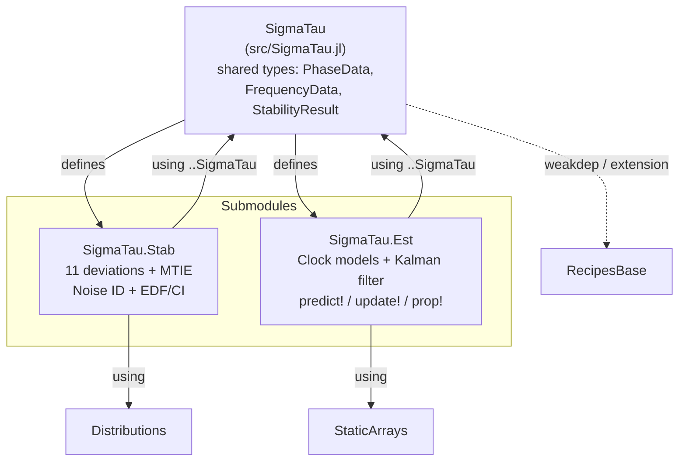

# SigmaTau.jl — Project Overview

> **Last Updated**: 2026-05-09 (post-MTIE/PDEV/prop! batch).
> **Scope**: Full audit of repository state at `https://github.com/ianlap/SigmaTau.jl`.
> Single registerable package with two submodules (`SigmaTau.Stab`, `SigmaTau.Est`); shared types at the top level.

---

## 1. Package Layout



A `docs/` subproject (Documenter.jl) develops `SigmaTau` as a single
path dep; its environment is independent of the package environment.
Source material lifted from the previous cross-language rendition lives
gitignored under `legdocs/`.

Single-package wiring: the root `Project.toml` declares one package
with merged `[deps]` (no `[workspace]`, no `[sources]`). Submodules
`Stab` and `Est` are defined inline in `src/SigmaTau.jl` and bring in
shared types via `using ..SigmaTau`. Every public symbol is re-exported
from the umbrella so casual user code (`using SigmaTau; adev(...)`)
remains unchanged.

---

## 2. Per-Component Status

### 2.1 Shared Types

| Component | File | Status | Notes |
|-----------|------|--------|-------|
| `PhaseData{T}` | [src/types/phase_data.jl](src/types/phase_data.jl) | ✅ | Parametric on `T<:AbstractFloat` |
| `FrequencyData{T}` | [src/types/frequency_data.jl](src/types/frequency_data.jl) | ✅ | Parametric; wired into every Stab dispatch |
| `StabilityResult` | [src/types/stability_result.jl](src/types/stability_result.jl) | ✅ | Non-parametric `Vector{Float64}` fields; includes `edf` (empty when `calc_ci=false`) |
| `AbstractTimingData` | [src/types/abstract.jl](src/types/abstract.jl) | ✅ | Abstract supertype |
| Tests | [test/types/runtests.jl](test/types/runtests.jl) | ✅ | Constructor + field smoke |

### 2.2 SigmaTau.Stab

#### Core Kernels

| Kernel | File | Status | Verified vs SP1065? |
|--------|------|--------|---------------------|
| `_adev_core` | [src/stab/core/allan.jl](src/stab/core/allan.jl) | ✅ | ✅ Tested (quadratic parity) |
| `_mdev_core` | same | ✅ | ⚠️ `isfinite`-only |
| `_tdev_core` | same | ✅ | ⚠️ `isfinite`-only |
| `_hdev_core` | [src/stab/core/hadamard.jl](src/stab/core/hadamard.jl) | ✅ | ⚠️ Zero-on-quadratic only |
| `_mhdev_core` | same | ✅ | ⚠️ Zero-on-quadratic only |
| `_totdev_core` | [src/stab/core/total.jl](src/stab/core/total.jl) | ✅ | ⚠️ `isfinite`-only |
| `_mtotdev_core` | same | ✅ | ⚠️ `isfinite`-only |
| `_htotdev_core` | same | ✅ | ⚠️ `isfinite`-only |
| `_mhtotdev_core` | same | ✅ | ⚠️ `isfinite`-only |
| `_mtie_core` | [src/stab/core/mtie.jl](src/stab/core/mtie.jl) | ✅ | Sliding peak-to-peak; ITU-T G.810 |
| `_pdev_core` | [src/stab/core/pdev.jl](src/stab/core/pdev.jl) | ✅ | Vernotte 2016/2020; allantools formula parity |

#### Noise Identification

| Component | File | Status | Notes |
|-----------|------|--------|-------|
| `identify_noise` | [src/stab/noise/lag1.jl](src/stab/noise/lag1.jl) | ✅ | lag-1 ACF + B1/R(n) fallback |
| `_noise_id_lag1acf` | same | ✅ | Quadratic detrend, differencing, ρ threshold |
| `_noise_id_b1rn` | same | ✅ | B1-ratio with R(n) WPM/FLPM disambiguation |
| `NEFF_RELIABLE = 30` | same | ✅ | Per legacy GEMINI.md §2 mandate; boundary test added |
| Preprocessing | same | ✅ | 5σ outlier rejection + linear detrend |
| Power-law synthesis | [src/stab/noise/synth.jl](src/stab/noise/synth.jl) | ✅ | f^(α/2) shaping for α ∈ {2, 1, 0, -1, -2} |

#### Statistics (EDF / CI / Bias)

| Component | File | Status | Notes |
|-----------|------|--------|-------|
| `calculate_edf` | [src/stab/stats/edf.jl](src/stab/stats/edf.jl) | ✅ | Full Greenhall/Riley `_compute_sz/_sx/_sw` |
| `confidence_intervals` | same | ✅ | `Distributions.jl` for χ² + Normal |
| `bias_correction` | same | ✅ | totvar / mtot / htot covered; mhtot has no published model |
| `_coeff_totvar` | same | ✅ | ADEV-style EDF fallback for α=2,1; published values for α∈{0,-1,-2} |
| `_coeff_htot` | same | ✅ | HDEV-style EDF fallback for α=2,1; published values for α∈{0,-1,-2} |
| `_coeff_mtot`, `_coeff_mhtot` | same | ✅ | Cover α∈[-2,2] |

#### User API

| Function | File | Status | Notes |
|----------|------|--------|-------|
| `adev`, `mdev` | [src/stab/api/allan.jl](src/stab/api/allan.jl) | ✅ | PhaseData → StabilityResult with CI |
| `tdev` | same | ✅ | Wraps `mdev` and scales by `τ/√3` |
| `hdev`, `mhdev`, `htdev` | [src/stab/api/hadamard.jl](src/stab/api/hadamard.jl) | ✅ | `htdev` wraps `mhdev` and scales by `τ/√(10/3)`; `ldev` retained as deprecated alias |
| `totdev`, `mtotdev`, `htotdev`, `mhtotdev` | [src/stab/api/total.jl](src/stab/api/total.jl) | ✅ | Bias correction applied where defined |
| `mtie` | [src/stab/api/mtie.jl](src/stab/api/mtie.jl) | ✅ | No CI fields (no published EDF model) |
| `pdev` | [src/stab/api/pdev.jl](src/stab/api/pdev.jl) | ✅ | No CI fields (EDF port tracked in TODO) |
| `FrequencyData` dispatches | [src/stab/utils.jl](src/stab/utils.jl) + each api file | ✅ | All 12 deviations accept `FrequencyData`; `_freq_to_phase` converts via `cumsum(y)·τ₀` |

#### Tests

| Test | Status | Notes |
|------|--------|-------|
| [test/stab/runtests.jl](test/stab/runtests.jl) | ✅ All pass | Full suite is 633 tests across the package |
| Numerical legacy parity | ✅ | 52 assertions across 8 kernels at rtol=1e-12 |
| Stable32 cross-validation | ✅ | 85 rows checked vs `reference/validation/stable32_data_full.csv` |
| allantools cross-validation | ✅ | 7 deviations × 12 m-values = 85 rows at rtol=1e-11 |
| Multi-noise MTOTDEV validation | ✅ | All 5 SP1065 noise types via [`_gen_powerlaw_phase`](src/stab/noise/synth.jl) |
| ADEV/MDEV/HDEV/MHDEV across α∈{-2..2} | ✅ | Synthesised noise + legacy-kernel parity |
| Noise-ID boundary at `NEFF_RELIABLE` | ✅ | Tested at N_eff ∈ {29, 31} |
| TOTDEV/HTOTDEV EDF fallback for WPM/FLPM | ✅ | ADEV/HDEV-style fallback covers α=2,1 |
| MTIE | ✅ | Hand fixture + monotonic ramp + naive-double-loop parity at rtol=1e-15 |
| PDEV | ✅ | m=1 ≡ ADEV identity, linear-trend annihilation, allantools formula parity at rtol=1e-12 |

### 2.3 SigmaTau.Est

| Component | File | Status | Notes |
|-----------|------|--------|-------|
| `TwoStateClock`, `ThreeStateClock` | [src/est/models/clocks.jl](src/est/models/clocks.jl) | ✅ | `@kwdef` + StaticArrays Φ/Q/H/R |
| `state_transition(model[, dt])` | same | ✅ | dt-overload for arbitrary horizons; single-arg defers to `model.tau` |
| `process_noise(model[, dt])` | same | ✅ | Closed-form Galleani/Zucca integration; dt-overload mirrors Φ |
| `RelativisticClock` | same | 🔲 Stub | Empty struct (lunar PNT future work) |
| `StandardKalmanFilter` | [src/est/estimators/filters.jl](src/est/estimators/filters.jl) | ✅ | AD-clean default; opt-in `legacy_compat` |
| `predict!`, `update!` | same | ✅ | Out-of-place SMatrix math; symmetrized P. `predict!` keeps the legacy `est.k > 0` gate. |
| `prop!` | same | ✅ | Unconditional covariance propagation; uses dt-overloads of Φ/Q. Powers shaded ±1σ holdover bands without disturbing live filter sequencing. |
| `safe_sqrt_sq` + `clamp_covariance_diag` | same | ✅ | Reproduces MATLAB-era diagonal clamping when `legacy_compat=true` |
| `UDFactorizedFilter`, `KuramotoOscillator` | same | 🔲 Stub | Reserved for lunar PNT / SWaP work |
| `PIDController`, `step!`, `steer_to_correction` | same | ✅ | Ported; `predict!(…; steering=…)` and `prop!(…; steering=…)` integrate the correction |
| `ClockNoiseParams` | — | ✅ | Inlined as `q0..q3` fields on clock structs (intentional design choice) |

#### Tests

| Test | Status | Notes |
|------|--------|-------|
| [test/est/runtests.jl](test/est/runtests.jl) | ✅ | 41+ assertions: Φ/Q parity, legacy_compat Kalman parity, AD-clean parity, TwoStateClock smoke, PID step + steering-corrected predict, **prop! Q-integration parity**, **prop! group/additivity composition**, **prop! vs predict! parity after k>0**, **prop! steering**, **prop! covariance band over horizons** |

### 2.4 SigmaTau Umbrella

| Component | Status | Notes |
|-----------|--------|-------|
| `@reexport` wiring | ✅ | Stab + Est public symbols re-exported from `SigmaTau` |
| Root `Project.toml` deps | ✅ | Single-package manifest; no `[workspace]` / `[sources]` |
| Plot recipes | [ext/SigmaTauRecipesBaseExt.jl](ext/SigmaTauRecipesBaseExt.jl) | ✅ | Package extension on `RecipesBase`; auto-loads with `Plots` |
| Umbrella smoke test | [test/umbrella_smoke.jl](test/umbrella_smoke.jl) | ✅ | Verifies `using SigmaTau` exposes every public symbol; FrequencyData dispatch on every deviation; `ldev` ≡ `htdev`. |
| `examples/` | ✅ | Five Literate-driven tutorials (`01_phase_data` → `05_holdover_comparison`) |

---

## 3. Open Questions

### Resolved

| # | Question | Resolution |
|---|----------|------------|
| 1 | Distributions.jl vs lightweight CDF? | ✅ `Distributions.jl` in deps |
| 2 | `predict!/update!` return value? | ✅ Returns `est` (self) |
| 3 | `update!` signature? | ✅ `update!(est, model, z)` — model carries H, R |
| 4 | `safe_sqrt`? | ✅ Re-introduced as `legacy_compat=true` opt-in (default off) |
| 5 | `ClockNoiseParams` struct vs inline? | ✅ Inlined as `q0..q3` |
| 6 | Workspace package resolution? | ✅ Single-package `Project.toml` (workspace tree dropped) |
| 7 | `NEFF_RELIABLE = 50 or 30`? | ✅ Set to 30 (GEMINI.md §2 mandate) |
| 8 | `prop!` covariance propagation? | ✅ Shipped (this batch); dt-overloads of Φ/Q under it |
| 9 | `StabilityResult.edf` field? | ✅ Added; populated when `calc_ci=true`, empty otherwise |

### Still Open

| # | Question | Source | Impact |
|---|----------|--------|--------|
| 10 | MHTOTDEV EDF model refinement | — | 🟡 Uses HTOT approx (known limitation) |
| 11 | `_coeff_totvar` α=2,1 entries | SP1065 | 🟡 NaN EDF for WPM/FLPM under TOTDEV |
| 12 | `RelativisticClock` implementation | — | 🟢 Future lunar PNT work |
| 13 | 5-state diurnal clock model | — | 🟢 Not yet needed |
| 14 | PDEV EDF / χ² CI port | Vernotte 2015/2020 | 🟢 Closed-form coefficients exist |

---

## 4. Known Risks & Technical Debt

### 🟡 Medium

| ID | Risk | Impact |
|----|------|--------|
| R-MED-5 | HTDEV CI scaling unverified | CI bounds scaled linearly from MHDEV — likely valid but no formal check |
| R-MED-6 | HTOTDEV EDF off-by-one suspected | Flagged in legacy `discrepancies.md` — not yet audited |
| R-MED-7 | Noise-ID does not block-process for N > 10⁷ | Performance (not correctness) limit |
| R-MED-8 | `predict!` ignores its `dt` arg, uses `model.tau` | Latent — no caller hits it today; flagged in TODO |

### 🟢 Low / Polish

| ID | Risk |
|----|------|
| R-LOW-3 | Tutorials cover the single-clock + steering + holdover path; multi-clock ensemble + relativistic walk-throughs queued |
| R-LOW-4 | `Documenter.jl` site skeleton shipped; tutorial pages are stubs (theory pages now filled out) |
| R-LOW-5 | `RelativisticClock`, `UDFactorizedFilter`, `KuramotoOscillator` are stubs |
| R-LOW-6 | MTIE kernel is O(N·m); monotonic-deque optimisation queued (TODO) |

---

## 5. Design Principle Compliance

| Principle | Status | Notes |
|-----------|--------|-------|
| No "God Engine" | ✅ | I/O (types), math (Stab cores), stats (edf.jl), plotting (recipes ext) are separate |
| Type-Driven Dispatch | ✅ | API takes `PhaseData` / `FrequencyData`, returns `StabilityResult`; cores take `Vector{Float64}` |
| Dual-Use API (Tier 1/Tier 2) | ✅ | `_*_core` exported alongside high-level wrappers |
| AD-Friendly Ensembling | ✅ | Default path is out-of-place StaticArrays; mutation only opt-in |
| StaticArrays for Kalman | ✅ | All Φ, Q, H, R, x, P use `@SMatrix`/`SVector`; dt-overloads preserve this |
| Covariance prediction without coupling to update | ✅ | `prop!` is a side-channel propagator; never bumps `est.k` |

---

## 6. File Inventory (tracked, public repo)

```
.gitignore
LICENSE                                  MIT, © Ian Lapinski 2026
README.md                                Project intro + quickstart + badges
CHANGELOG.md                             Keep-a-Changelog
TODO.md                                  Outstanding work, sorted by priority
project_overview.md                      This file (per-component audit)
Project.toml                             Single-package manifest + extension
src/
├── SigmaTau.jl                          Umbrella + @reexport wiring
├── types/{abstract,phase_data,frequency_data,stability_result}.jl
├── stab/
│   ├── core/{allan,hadamard,total,mtie,pdev}.jl
│   ├── noise/{lag1,synth}.jl
│   ├── stats/edf.jl
│   ├── api/{allan,hadamard,total,mtie,pdev}.jl
│   └── utils.jl                         (FrequencyData → PhaseData helper)
└── est/
    ├── models/clocks.jl                 (TwoState, ThreeState, RelativisticClock stub; Φ + Q with dt overloads)
    └── estimators/filters.jl            (StandardKalmanFilter; predict!, update!, prop!; PID + steering)

ext/SigmaTauRecipesBaseExt.jl            RecipesBase extension (loaded with Plots)

test/
├── runtests.jl                          Aggregator
├── types/runtests.jl
├── stab/runtests.jl                     + allantools_cross_validation.jl + legacy_kernels.jl
├── est/runtests.jl
└── umbrella_smoke.jl                    using-SigmaTau re-export check + FrequencyData dispatch

docs/                                    Documenter.jl subproject
benchmarks/                              Long-record perf runs (gitignored outputs)
examples/                                Literate-driven tutorials 01..05
reference/validation/                    Stable32 + allantools cross-check fixtures
tools/Project.toml                       Dev-tools env
```

The `legacy/`, `legdocs/`, `lib.bak/`, `rough_changelog/`, and per-package
`Manifest.toml` files exist locally but are gitignored — they are not
part of the published package.
