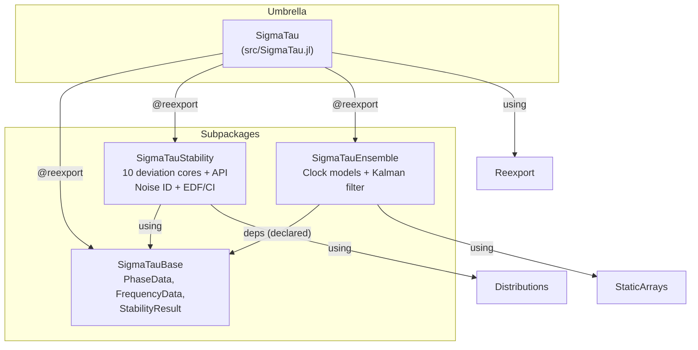

# SigmaTau.jl — Project Overview

> **Last Updated**: 2026-05-07 by Project Overseer
> **Scope**: Full audit of monorepo state after 3 implementation phases

---

## 1. Package Dependency Graph



> [!IMPORTANT]
> `SigmaTauEnsemble` declares `SigmaTauBase` in its `Project.toml` deps, but does **not** `using SigmaTauBase` in its module file. The Ensemble test file includes legacy code directly and doesn't reference Base types. This is an integration gap.

---

## 2. Per-Subpackage Status

### 2.1 SigmaTauBase

| Component | File | Status | Notes |
|-----------|------|--------|-------|
| `PhaseData{T}` | [SigmaTauBase.jl](file:///Users/ianlapinski/Downloads/SigmaTau-dev/lib/SigmaTauBase/src/SigmaTauBase.jl) | ✅ Done | Parametric on `T<:AbstractFloat` |
| `FrequencyData{T}` | same | ✅ Done | Parametric |
| `StabilityResult` | same | ✅ Done | Non-parametric, `Vector{Float64}` fields |
| `AbstractTimingData` | same | ✅ Done | Abstract supertype |
| **Tests** | — | ❌ None | No test directory or test file exists |

> [!WARNING]
> `StabilityResult` is not parametric — all fields are `Vector{Float64}`. If AD through stability results is ever needed, this will be a bottleneck. Also missing: `edf` field (EDF values are computed but not stored in the result).

### 2.2 SigmaTauStability

#### Core Kernels

| Kernel | File | Status | Verified vs SP1065? |
|--------|------|--------|---------------------|
| `_adev_core` | [core/allan.jl](file:///Users/ianlapinski/Downloads/SigmaTau-dev/lib/SigmaTauStability/src/core/allan.jl) | ✅ Implemented | ✅ Tested (quadratic parity) |
| `_mdev_core` | same | ✅ Implemented | ⚠️ Only finite-check test |
| `_tdev_core` | same | ✅ Implemented | ⚠️ Only finite-check test |
| `_hdev_core` | [core/hadamard.jl](file:///Users/ianlapinski/Downloads/SigmaTau-dev/lib/SigmaTauStability/src/core/hadamard.jl) | ✅ Implemented | ⚠️ Zero-on-quadratic check only |
| `_mhdev_core` | same | ✅ Implemented | ⚠️ Zero-on-quadratic check only |
| `_totdev_core` | [core/total.jl](file:///Users/ianlapinski/Downloads/SigmaTau-dev/lib/SigmaTauStability/src/core/total.jl) | ✅ Implemented | ⚠️ Only finite-check test |
| `_mtotdev_core` | same | ✅ Implemented | ⚠️ Only finite-check test |
| `_htotdev_core` | same | ✅ Implemented | ⚠️ Only finite-check test |
| `_mhtotdev_core` | same | ✅ Implemented | ⚠️ Only finite-check test |

#### Noise Identification

| Component | File | Status | Notes |
|-----------|------|--------|-------|
| `identify_noise` | [noise/lag1.jl](file:///Users/ianlapinski/Downloads/SigmaTau-dev/lib/SigmaTauStability/src/noise/lag1.jl) | ✅ Implemented | Full dispatch: lag-1 ACF + B1/R(n) fallback |
| `_noise_id_lag1acf` | same | ✅ Implemented | Quadratic detrend, differencing, rho threshold |
| `_noise_id_b1rn` | same | ✅ Implemented | B1-ratio with R(n) WPM/FLPM disambiguation |
| `NEFF_RELIABLE = 50` | same | ⚠️ TODO says 30 | Legacy TODO mandates update to 30 per GEMINI.md §2 |
| Preprocessing | same | ✅ Implemented | 5σ outlier rejection + linear detrend |

#### Statistics (EDF / CI / Bias)

| Component | File | Status | Notes |
|-----------|------|--------|-------|
| `calculate_edf` | [stats/edf.jl](file:///Users/ianlapinski/Downloads/SigmaTau-dev/lib/SigmaTauStability/src/stats/edf.jl) | ✅ Implemented | Full Greenhall/Riley `_compute_sz/_sx/_sw` + total coefficients |
| `confidence_intervals` | same | ✅ Implemented | Uses `Distributions.jl` (Chisq + Normal) — resolved |
| `bias_correction` | same | ✅ Implemented | totvar, mtot, htot covered; mhtot skipped (no model) |
| Coefficient tables | same | ✅ Implemented | `_coeff_totvar`, `_coeff_mtot`, `_coeff_htot`, `_coeff_mhtot` |

#### User API

| Function | File | Status | Notes |
|----------|------|--------|-------|
| `adev` | [api/allan.jl](file:///Users/ianlapinski/Downloads/SigmaTau-dev/lib/SigmaTauStability/src/api/allan.jl) | ✅ Full | PhaseData → StabilityResult with CI |
| `mdev` | same | ✅ Full | PhaseData → StabilityResult with CI |
| `hdev` | [api/hadamard.jl](file:///Users/ianlapinski/Downloads/SigmaTau-dev/lib/SigmaTauStability/src/api/hadamard.jl) | ✅ Full | PhaseData → StabilityResult with CI |
| `mhdev` | same | ✅ Full | PhaseData → StabilityResult with CI |
| `ldev` | same | ✅ Full | Wraps mhdev, scales by `τ/√(10/3)` |
| `totdev` | [api/total.jl](file:///Users/ianlapinski/Downloads/SigmaTau-dev/lib/SigmaTauStability/src/api/total.jl) | ✅ Full | Includes bias correction |
| `mtotdev` | same | ✅ Full | Includes bias correction |
| `htotdev` | same | ✅ Full | Includes bias correction |
| `mhtotdev` | same | ✅ Full | No bias correction (per spec) |
| `tdev` | — | ❌ Missing | `_tdev_core` exists but no `tdev(::PhaseData)` wrapper |
| **FrequencyData API** | — | ❌ Missing | No deviation function accepts `FrequencyData` yet |

#### Tests

| Test | Status | Notes |
|------|--------|-------|
| [runtests.jl](file:///Users/ianlapinski/Downloads/SigmaTau-dev/lib/SigmaTauStability/test/runtests.jl) | ⚠️ Passes (30/30) | Tests are **weak**: mostly `isfinite` and shape checks |
| NIST SP1065 parity | ❌ Missing | No tests against published NIST reference values |
| Stable32 parity | ❌ Missing | No tests against Stable32 expected outputs |
| Multi-noise validation | ❌ Missing | TODO: verify mtot across WPM→RWFM |
| Noise ID categorical | ⚠️ Minimal | One seed, not systematic |

### 2.3 SigmaTauEnsemble

| Component | File | Status | Notes |
|-----------|------|--------|-------|
| `TwoStateClock` | [clocks.jl](file:///Users/ianlapinski/Downloads/SigmaTau-dev/lib/SigmaTauEnsemble/src/models/clocks.jl) | ✅ Implemented | `@kwdef`, StaticArrays Φ/Q/H/R |
| `ThreeStateClock` | same | ✅ Implemented | IRWFM terms included |
| `RelativisticClock` | same | 🔲 Stub only | Empty struct, no methods |
| `StandardKalmanFilter` | [filters.jl](file:///Users/ianlapinski/Downloads/SigmaTau-dev/lib/SigmaTauEnsemble/src/estimators/filters.jl) | ✅ Implemented | AD-friendly out-of-place |
| `predict!` | same | ✅ Implemented | Skips k=0 (first step) |
| `update!` | same | ✅ Implemented | Joseph-form symmetrization |
| `UDFactorizedFilter` | same | 🔲 Stub only | Empty struct |
| `KuramotoOscillator` | same | 🔲 Stub only | Empty struct |
| `StaticArrays` dep | [Project.toml](file:///Users/ianlapinski/Downloads/SigmaTau-dev/lib/SigmaTauEnsemble/Project.toml) | ⚠️ Missing | `StaticArrays` is `using`'d but NOT in Project.toml deps! |
| `safe_sqrt` | — | ❌ Intentionally omitted | Legacy MATLAB artifact; could cause P-diagonal issues |
| **PID Steering** | — | ❌ Not ported | Deferred per implementation plan |
| `ClockNoiseParams` | — | ❌ Not ported | Noise params inlined into clock structs instead |
| `ml_hooks/` | [ml_hooks/](file:///Users/ianlapinski/Downloads/SigmaTau-dev/lib/SigmaTauEnsemble/src/ml_hooks) | 🔲 Empty dir | No files |

> [!CAUTION]
> **Critical: Ensemble parity tests are FAILING (0/4 pass).** The `test_output.log` shows massive divergence between legacy and new Kalman filter outputs starting from step 2. Root cause analysis in §4.

### 2.4 SigmaTau Umbrella

| Component | Status | Notes |
|-----------|--------|-------|
| `@reexport` wiring | ✅ Done | Base, Stability, Ensemble |
| `PlotRecipes.jl` | 🔲 Stub | All recipe code commented out |
| `SigmaTauBase` not in deps | ⚠️ Missing | Root `Project.toml` lists Stability + Ensemble but not Base |
| Root `Manifest.toml` | ❌ Missing | Package resolution not yet run |

---

## 3. Consolidated Open Questions

### Resolved

| # | Question | Resolution |
|---|----------|------------|
| 1 | **Distributions.jl vs lightweight CDF?** (plan1) | ✅ Resolved: `Distributions.jl` added to SigmaTauStability deps |
| 2 | **`predict!/update!` return nothing or self?** (plan0) | ✅ Returns `est` (self) |
| 3 | **`update!` signature: `(est, z)` or `(est, model, z)`?** (plan2) | ✅ `update!(est, model, z)` — model provides H, R |
| 4 | **safe_sqrt?** (walkthrough2) | ✅ Intentionally dropped — MATLAB artifact |

### Still Open

| # | Question | Source | Impact |
|---|----------|--------|--------|
| 5 | **NEFF_RELIABLE = 50 or 30?** | TODO.md, GEMINI.md §2 | 🟡 Noise ID accuracy at boundary |
| 6 | **PID steering: port now or defer?** | plan2 Q2 | 🟢 Deferred, but blocks clock steering examples |
| 7 | **ClockNoiseParams struct: port or inline?** | plan2 Q1 | ✅ Inlined into clock structs (q0-q3) |
| 8 | **Extra PhaseData/FrequencyData metadata?** | plan0 | 🟢 Low priority |
| 9 | **Extra StabilityResult fields (edf, bias)?** | plan0 | 🟡 EDF computed but not stored |
| 10 | **MHTOTDEV EDF model refinement** | TODO.md | 🔴 Uses HTOT approx — known limitation |
| 11 | **RelativisticClock implementation** | clocks.jl | 🟢 Stub — lunar PNT future work |
| 12 | **5-state diurnal clock model** | kalman.md | 🟢 Not yet needed |

---

## 4. Known Risks & Technical Debt

### 🔴 Critical — Blocking

#### RISK-1: Ensemble Kalman Filter Parity Failure

**All 4 parity tests fail.** The divergence pattern reveals two issues:

1. **P-matrix initialization mismatch**: Legacy `P_history[:,:,1]` is all zeros; new filter's first P is `[1e-22, 0, 0; 0, 1e-12, 0; 0, 0, 1e-12]`. The legacy filter likely zeros out `P` after the first update via `safe_sqrt` clamping or a different initialization convention, while the new filter preserves the post-update P.

2. **Prediction skip logic**: `predict!` skips when `k == 0`, but `k` is incremented inside `update!`. The call order in tests is `predict! → update!`, so at step 1: predict skips (k=0), update increments k to 1, stores result. At step 2: predict runs (k=1). This is correct in principle, but the legacy `kalman_filter` wrapper likely has a different predict/update ordering or initialization convention that must be matched exactly.

3. **`safe_sqrt` omission**: Legacy clamps P diagonals < 1e-10 to zero. With `P0=I` (huge relative to 1e-10 scale data), the first update produces very different gain/covariance paths when one implementation clamps and the other doesn't. The test uses `q0=1e-2, q1=1e-3, q2=1e-4, q3=1e-5` which are orders of magnitude larger than the `1e-10`-scale phase data — the R/Q mismatch amplifies divergence.

**Action Required**: Debug the predict/update ordering against `legacy/julia/src/filter.jl` line by line, and reconcile the `safe_sqrt` clamping decision.

#### RISK-2: SigmaTauBase Not Resolvable

The `err.log` shows `expected package SigmaTauBase [e7b0a8c4] to be registered` — the workspace resolution for local packages isn't working. Must add `[sources]` sections to each subpackage's Project.toml pointing to the local path, or ensure the root workspace `[workspace]` block is properly configured for Julia 1.11 monorepo semantics.

### 🟡 Medium

| ID | Risk | Impact |
|----|------|--------|
| RISK-3 | **StaticArrays missing from Ensemble Project.toml** | Package won't load in clean environment |
| RISK-4 | **No NIST SP1065 reference value tests** | Can't verify deviation correctness beyond "is finite" |
| RISK-5 | **`tdev` API missing** | Users can't call `tdev(::PhaseData)` despite core existing |
| RISK-6 | **No FrequencyData path** | Only PhaseData → deviation; FrequencyData declared but unused |
| RISK-7 | **LDEV CI scaling** | CI bounds scaled linearly from MHDEV — valid if proportional, but no formal verification |
| RISK-8 | **HTOTDEV EDF off-by-one** | discrepancies.md #2 flags potential off-by-one in htotdev EDF loop — not yet audited |
| RISK-9 | **Noise ID scaling for N > 10⁷** | TODO.md: block-processing not implemented |
| RISK-10 | **`_coeff_totvar` missing α=2 and α=1** | Returns `(NaN, NaN)` for WPM/FLPM noise in totdev EDF |

### 🟢 Low / Polish

| ID | Risk |
|----|------|
| RISK-11 | PlotRecipes entirely stubbed |
| RISK-12 | `ml_hooks/` empty directory |
| RISK-13 | No CI/CD pipeline |
| RISK-14 | `examples/` directory empty |
| RISK-15 | No documentation beyond equation docs |
| RISK-16 | GEMINI.md §2.3 and Goal G2 stale (4-arg migration completed but doc not updated) |

---

## 5. Design Principle Compliance

| Principle | Status | Notes |
|-----------|--------|-------|
| **No "God Engine"** | ✅ Compliant | I/O (Base), math (Stability cores), stats (edf.jl), plotting (stub) are separate |
| **Type-Driven Dispatch** | ✅ Compliant | API functions accept `PhaseData`, return `StabilityResult`; cores accept `Vector{Float64}` |
| **Dual-Use API** | ✅ Compliant | Tier 1 (`_adev_core` etc.) and Tier 2 (`adev` etc.) properly separated |
| **AD-Friendly Ensembling** | ✅ Compliant | Out-of-place StaticArrays; no in-place mutation in hot path |
| **StaticArrays for Kalman** | ✅ Compliant | All Φ, Q, H, R, x, P use `@SMatrix`/`SVector` |

---

## 6. File Inventory

### Source Files (lib/)

```
lib/SigmaTauBase/
├── Project.toml                        (112 B)
└── src/SigmaTauBase.jl                 (706 B)  — PhaseData, FrequencyData, StabilityResult

lib/SigmaTauStability/
├── Project.toml                        (406 B)  — deps: Distributions, SigmaTauBase, Statistics
├── Manifest.toml                       (9.3 KB) — resolved
├── src/SigmaTauStability.jl            (604 B)  — module + includes + exports
├── src/core/allan.jl                   (2.0 KB) — _adev_core, _mdev_core, _tdev_core
├── src/core/hadamard.jl                (1.8 KB) — _hdev_core, _mhdev_core
├── src/core/total.jl                   (9.4 KB) — _totdev_core, _mtotdev_core, _htotdev_core, _mhtotdev_core
├── src/noise/lag1.jl                   (6.3 KB) — identify_noise, lag-1 ACF, B1-ratio/R(n)
├── src/stats/edf.jl                    (6.8 KB) — calculate_edf, confidence_intervals, bias_correction
├── src/api/allan.jl                    (1.7 KB) — adev, mdev
├── src/api/hadamard.jl                 (2.4 KB) — hdev, mhdev, ldev
├── src/api/total.jl                    (3.9 KB) — totdev, mtotdev, htotdev, mhtotdev
└── test/runtests.jl                    (2.9 KB) — 30 tests, passes

lib/SigmaTauEnsemble/
├── Project.toml                        (233 B)  — deps: LinearAlgebra, SigmaTauBase (MISSING StaticArrays!)
├── err.log                             (2.8 KB) — SigmaTauBase resolution error
├── test_output.log                     (9.6 KB) — 0/4 parity tests pass
├── src/SigmaTauEnsemble.jl             (330 B)  — module + includes + exports
├── src/models/clocks.jl                (1.6 KB) — TwoStateClock, ThreeStateClock, RelativisticClock
├── src/estimators/filters.jl           (2.1 KB) — StandardKalmanFilter, predict!, update!
├── src/ml_hooks/                       (empty)
└── test/runtests.jl                    (2.8 KB) — parity test (FAILING)
```

### Root

```
Project.toml                            (390 B)  — umbrella workspace
src/SigmaTau.jl                         (170 B)  — @reexport
src/PlotRecipes.jl                      (387 B)  — stub (commented out)
```
