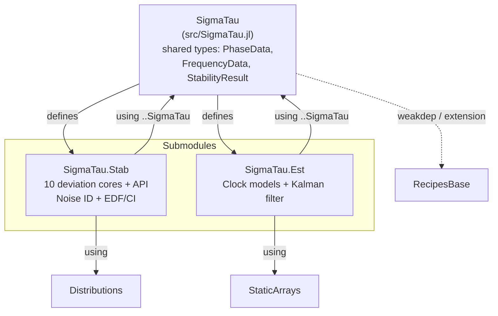

# SigmaTau.jl — Project Overview

> **Last Updated**: 2026-05-09 (post-restructure)
> **Scope**: Full audit of repository state at `https://github.com/ianlap/SigmaTau.jl`

> **Restructure note (2026-05-09):** the previous three-subpackage
> workspace (`SigmaTauBase` / `SigmaTauStability` / `SigmaTauEnsemble`)
> was collapsed into a single package with two submodules
> (`SigmaTau.Stab`, `SigmaTau.Est`). The Section 2 status tables below
> are still labeled by their old subpackage names while the per-symbol
> status content stays correct; the file: links point into the new
> `src/{types,stab,est}/` tree.

---

## 1. Package Layout



A `docs/` subproject (Documenter.jl) develops `SigmaTau` as a single
path dep; its environment is independent of the package environment.
Source material lifted from the previous cross-language rendition lives
gitignored under `legdocs/`.

Single-package wiring: the root `Project.toml` declares one package
with merged `[deps]` (no `[workspace]`, no `[sources]`). Submodules
`Stab` and `Est` are defined inline in `src/SigmaTau.jl` and bring in
shared types via `using ..SigmaTau`. Every public symbol is re-exported
from the umbrella so casual user code (`using SigmaTau; adev(...)`)
remains unchanged.

---

## 2. Per-Subpackage Status

### 2.1 SigmaTauBase

| Component | File | Status | Notes |
|-----------|------|--------|-------|
| `PhaseData{T}` | [SigmaTauBase.jl](lib/SigmaTauBase/src/SigmaTauBase.jl) | ✅ Done | Parametric on `T<:AbstractFloat` |
| `FrequencyData{T}` | same | ✅ Done | Parametric; not yet wired into stability API |
| `StabilityResult` | same | ✅ Done | Non-parametric `Vector{Float64}` fields; includes `edf` (empty when `calc_ci=false`) |
| `AbstractTimingData` | same | ✅ Done | Abstract supertype |
| Tests | — | ❌ None | No test directory or test file |

### 2.2 SigmaTauStability

#### Core Kernels

| Kernel | File | Status | Verified vs SP1065? |
|--------|------|--------|---------------------|
| `_adev_core` | [core/allan.jl](lib/SigmaTauStability/src/core/allan.jl) | ✅ | ✅ Tested (quadratic parity) |
| `_mdev_core` | same | ✅ | ⚠️ `isfinite`-only |
| `_tdev_core` | same | ✅ | ⚠️ `isfinite`-only |
| `_hdev_core` | [core/hadamard.jl](lib/SigmaTauStability/src/core/hadamard.jl) | ✅ | ⚠️ Zero-on-quadratic only |
| `_mhdev_core` | same | ✅ | ⚠️ Zero-on-quadratic only |
| `_totdev_core` | [core/total.jl](lib/SigmaTauStability/src/core/total.jl) | ✅ | ⚠️ `isfinite`-only |
| `_mtotdev_core` | same | ✅ | ⚠️ `isfinite`-only |
| `_htotdev_core` | same | ✅ | ⚠️ `isfinite`-only |
| `_mhtotdev_core` | same | ✅ | ⚠️ `isfinite`-only |

#### Noise Identification

| Component | File | Status | Notes |
|-----------|------|--------|-------|
| `identify_noise` | [noise/lag1.jl](lib/SigmaTauStability/src/noise/lag1.jl) | ✅ | lag-1 ACF + B1/R(n) fallback |
| `_noise_id_lag1acf` | same | ✅ | Quadratic detrend, differencing, ρ threshold |
| `_noise_id_b1rn` | same | ✅ | B1-ratio with R(n) WPM/FLPM disambiguation |
| `NEFF_RELIABLE = 30` | same | ✅ Updated per legacy GEMINI.md §2 mandate; boundary test added |
| Preprocessing | same | ✅ | 5σ outlier rejection + linear detrend |

#### Statistics (EDF / CI / Bias)

| Component | File | Status | Notes |
|-----------|------|--------|-------|
| `calculate_edf` | [stats/edf.jl](lib/SigmaTauStability/src/stats/edf.jl) | ✅ | Full Greenhall/Riley `_compute_sz/_sx/_sw` |
| `confidence_intervals` | same | ✅ | `Distributions.jl` for χ² + Normal |
| `bias_correction` | same | ✅ | totvar / mtot / htot covered; mhtot has no published model |
| `_coeff_totvar` | same | ✅ ADEV-style EDF fallback for α=2,1; published values for α∈{0,-1,-2} |
| `_coeff_htot` | same | ✅ HDEV-style EDF fallback for α=2,1; published values for α∈{0,-1,-2} |
| `_coeff_mtot`, `_coeff_mhtot` | same | ✅ Cover α∈[-2,2] |

#### User API

| Function | File | Status | Notes |
|----------|------|--------|-------|
| `adev`, `mdev` | [api/allan.jl](lib/SigmaTauStability/src/api/allan.jl) | ✅ | PhaseData → StabilityResult with CI |
| `hdev`, `mhdev`, `htdev` | [api/hadamard.jl](lib/SigmaTauStability/src/api/hadamard.jl) | ✅ | `htdev` wraps `mhdev` and scales by `τ/√(10/3)`; `ldev` retained as deprecated alias |
| `totdev`, `mtotdev`, `htotdev`, `mhtotdev` | [api/total.jl](lib/SigmaTauStability/src/api/total.jl) | ✅ | Bias correction applied where defined |
| `tdev` | [api/allan.jl](lib/SigmaTauStability/src/api/allan.jl) | ✅ | Wraps `mdev` and scales by `τ/√3` |
| `FrequencyData` dispatches | [utils.jl](lib/SigmaTauStability/src/utils.jl) + each api file | ✅ | All 11 deviations accept `FrequencyData`; `_freq_to_phase` converts via `cumsum(y)·τ₀` |

#### Tests

| Test | Status | Notes |
|------|--------|-------|
| [runtests.jl](lib/SigmaTauStability/test/runtests.jl) | ✅ 339/339 pass |
| Numerical legacy parity | ✅ 52 assertions across 8 kernels at rtol=1e-12 ([`legacy_kernels.jl`](lib/SigmaTauStability/test/legacy_kernels.jl)) |
| Stable32 cross-validation | ✅ 86 assertions vs `reference/validation/stable32_data_full.csv` |
| Multi-noise MTOTDEV validation | ✅ All 5 SP1065 noise types via [`synth.jl`](lib/SigmaTauStability/src/noise/synth.jl) |
| ADEV/MDEV/HDEV/MHDEV across α∈{-2..2} | ✅ Synthesized noise + legacy-kernel parity |
| Noise-ID boundary at `NEFF_RELIABLE` | ✅ Tested at N_eff ∈ {29, 31} |
| TOTDEV/HTOTDEV EDF for WPM/FLPM | ✅ ADEV/HDEV-style fallback covers α=2,1 |

### 2.3 SigmaTauEnsemble

| Component | File | Status | Notes |
|-----------|------|--------|-------|
| `TwoStateClock`, `ThreeStateClock` | [clocks.jl](lib/SigmaTauEnsemble/src/models/clocks.jl) | ✅ | `@kwdef` + StaticArrays Φ/Q/H/R |
| `RelativisticClock` | same | 🔲 Stub | Empty struct (lunar PNT future work) |
| `StandardKalmanFilter` | [filters.jl](lib/SigmaTauEnsemble/src/estimators/filters.jl) | ✅ | AD-clean default; opt-in `legacy_compat` |
| `predict!`, `update!` | same | ✅ | Out-of-place SMatrix math; symmetrized P |
| `safe_sqrt_sq` + `clamp_covariance_diag` | same | ✅ | Reproduces MATLAB-era diagonal clamping when `legacy_compat=true` |
| `UDFactorizedFilter`, `KuramotoOscillator` | same | 🔲 Stub | Reserved for lunar PNT / SWaP work |
| `StaticArrays` dep | [Project.toml](lib/SigmaTauEnsemble/Project.toml) | ✅ Declared |
| `PIDController`, `step!`, `steer_to_correction` | same | ✅ Ported; `predict!(…; steering=…)` integrates the correction |
| `ClockNoiseParams` | — | ✅ Inlined as `q0..q3` fields on clock structs (intentional design choice) |

#### Tests

| Test | Status | Notes |
|------|--------|-------|
| [runtests.jl](lib/SigmaTauEnsemble/test/runtests.jl) | ✅ 21/21 pass | Φ/Q parity, legacy_compat Kalman parity, AD-clean parity, TwoStateClock smoke, PID step + steering-corrected predict |

### 2.4 SigmaTau Umbrella

| Component | Status | Notes |
|-----------|--------|-------|
| `@reexport` wiring | ✅ | Base, Stability, Ensemble |
| Root `Project.toml` deps + workspace + sources | ✅ | All three subpackages registered |
| Plot recipes | [ext/SigmaTauRecipesBaseExt.jl](ext/SigmaTauRecipesBaseExt.jl) | ✅ Package extension on `RecipesBase`; auto-loads with `Plots` |
| `examples/` | 🔲 Empty directory |

---

## 3. Open Questions

### Resolved

| # | Question | Resolution |
|---|----------|------------|
| 1 | Distributions.jl vs lightweight CDF? | ✅ `Distributions.jl` in deps |
| 2 | `predict!/update!` return value? | ✅ Returns `est` (self) |
| 3 | `update!` signature? | ✅ `update!(est, model, z)` — model carries H, R |
| 4 | `safe_sqrt`? | ✅ Re-introduced as `legacy_compat=true` opt-in (default off) |
| 5 | `ClockNoiseParams` struct vs inline? | ✅ Inlined as `q0..q3` |
| 6 | Workspace package resolution? | ✅ `[sources]` + `[workspace]` wired in all four `Project.toml` files |
| 7 | `NEFF_RELIABLE = 50 or 30`? | ✅ Set to 30 (GEMINI.md §2 mandate) |
| 9 | `StabilityResult.edf` field? | ✅ Added; populated when `calc_ci=true`, empty otherwise |

### Still Open

| # | Question | Source | Impact |
|---|----------|--------|--------|
| 8 | PID steering — port now or defer? | — | 🟢 Deferred; blocks steering examples |
| 10 | MHTOTDEV EDF model refinement | — | 🟡 Uses HTOT approx (known limitation) |
| 11 | `_coeff_totvar` α=2,1 entries | SP1065 | 🟡 NaN EDF for WPM/FLPM under TOTDEV |
| 12 | `RelativisticClock` implementation | — | 🟢 Future lunar PNT work |
| 13 | 5-state diurnal clock model | — | 🟢 Not yet needed |

---

## 4. Known Risks & Technical Debt

### 🟡 Medium

| ID | Risk | Impact |
|----|------|--------|
| R-MED-5 | HTDEV CI scaling unverified | CI bounds scaled linearly from MHDEV — likely valid but no formal check |
| R-MED-6 | HTOTDEV EDF off-by-one suspected | Flagged in legacy `discrepancies.md` — not yet audited |
| R-MED-7 | Noise-ID does not block-process for N > 10⁷ | Performance (not correctness) limit |

### 🟢 Low / Polish

| ID | Risk |
|----|------|
| R-LOW-3 | `examples/` only has a single quickstart |
| R-LOW-4 | `Documenter.jl` site skeleton shipped; tutorial pages are stubs (theory pages now filled out) |
| R-LOW-5 | `RelativisticClock`, `UDFactorizedFilter`, `KuramotoOscillator` are stubs |

---

## 5. Design Principle Compliance

| Principle | Status | Notes |
|-----------|--------|-------|
| No "God Engine" | ✅ | I/O (Base), math (Stability cores), stats (edf.jl), plotting (stub) are separate |
| Type-Driven Dispatch | ✅ | API takes `PhaseData`, returns `StabilityResult`; cores take `Vector{Float64}` |
| Dual-Use API (Tier 1/Tier 2) | ✅ | `_*_core` exported alongside high-level wrappers |
| AD-Friendly Ensembling | ✅ | Default path is out-of-place StaticArrays; mutation only opt-in |
| StaticArrays for Kalman | ✅ | All Φ, Q, H, R, x, P use `@SMatrix`/`SVector` |

---

## 6. File Inventory (tracked, public repo)

```
.gitignore
LICENSE                               MIT, © Ian Lapinski 2026
README.md                             Project intro + quickstart
CHANGELOG.md                          Keep-a-Changelog
TODO.md                               Outstanding work, sorted by priority
project_overview.md                   This file (per-component audit)
Project.toml                          Umbrella workspace + extension
src/SigmaTau.jl                       @reexport wiring
ext/SigmaTauRecipesBaseExt.jl         RecipesBase extension (loaded with Plots)
tools/Project.toml                    Dev-tools env

lib/SigmaTauBase/
├── Project.toml
└── src/SigmaTauBase.jl

lib/SigmaTauStability/
├── Project.toml
├── src/SigmaTauStability.jl
├── src/core/{allan,hadamard,total}.jl
├── src/noise/lag1.jl
├── src/stats/edf.jl
├── src/api/{allan,hadamard,total}.jl
├── src/utils.jl                       (FrequencyData → PhaseData helper)
└── test/runtests.jl

lib/SigmaTauEnsemble/
├── Project.toml
├── src/SigmaTauEnsemble.jl
├── src/models/clocks.jl
├── src/estimators/filters.jl
└── test/runtests.jl

reference/validation/                 (Stable32 cross-check fixtures)
```

The `legacy/`, `rough_changelog/`, and per-package `Manifest.toml` files exist
locally but are gitignored — they are not part of the published package.
