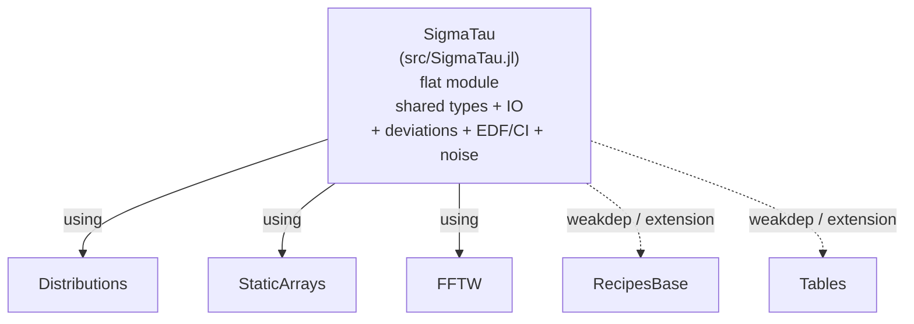

# SigmaTau.jl — Project Overview

> **Last Updated**: 2026-06-07.
> **Scope**: Single registerable Julia 1.11 package, flat module —
> deviation kernels, noise identification, EDF/CI, spectral densities
> (S_y / S_x / ℒ), calibrated noise generation, and file IO for
> time-and-frequency stability analysis.

For clock state-space estimation and Kalman steering, see the sister
package [ClockEnsemble.jl](https://github.com/ianlap/ClockEnsemble.jl)
(formerly the `SigmaTau.Est` submodule).

---

## 1. Package Layout


```mermaid
graph TD
    ST["SigmaTau<br/>(src/SigmaTau.jl)<br/>flat module<br/>shared types + IO<br/>+ deviations + EDF/CI + noise"]
    ST -->|"using"| Distributions
    ST -->|"using"| StaticArrays
    ST -->|"using"| FFTW
    ST -.->|"weakdep / extension"| RecipesBase
    ST -.->|"weakdep / extension"| Tables
```

A `docs/` subproject (Documenter.jl) develops `SigmaTau` as a single
path dep; its environment is independent of the package environment.
Source material lifted from the previous cross-language rendition lives
gitignored under `legdocs/`.

Single-package wiring: the root `Project.toml` declares one package
with a small `[deps]` (no `[workspace]`, no `[sources]`, no
submodules). Every public symbol is exported directly from `SigmaTau`
so user code is just `using SigmaTau; adev(...)`.

---

## 2. Per-Component Status

### 2.1 Shared Types

| Component | File | Notes |
|-----------|------|-------|
| `PhaseData{T}` | [src/types/phase_data.jl](src/types/phase_data.jl) | Parametric on `T<:AbstractFloat`; ctor validates `tau0 > 0` and length ≥ 2 |
| `FrequencyData{T}` | [src/types/frequency_data.jl](src/types/frequency_data.jl) | Parametric; wired into every Stab dispatch; ctor validates `tau0 > 0` and length ≥ 2 |
| `StabilityResult` | [src/types/stability_result.jl](src/types/stability_result.jl) | Non-parametric `Vector{Float64}` fields; includes `edf` (empty when `ci=false`) |
| `StabilitySuite` | [src/types/stability_suite.jl](src/types/stability_suite.jl) | Ordered, symbol-indexable collection of `StabilityResult`s + session metadata; produced by `stability` |
| `SpectralResult` | [src/types/spectral_result.jl](src/types/spectral_result.jl) | Non-parametric; `freq`/`psd` + `units` + Welch params; produced by `Sy`/`Sx`/`L` |
| `AbstractTimingData` | [src/types/abstract.jl](src/types/abstract.jl) | Abstract supertype |

### 2.2 Stability Surface

#### Core Kernels

Internal — **not exported** (reach via `SigmaTau._adev_core`); the leading
underscore marks them unsupported. Each takes `Vector{Float64}` and returns a
raw `Vector{Float64}`.

| Kernel | File | Notes |
|--------|------|-------|
| `_adev_core`, `_mdev_core`, `_tdev_core` | [src/stab/core/allan.jl](src/stab/core/allan.jl) | Overlapping ADEV / MDEV / TDEV |
| `_hdev_core`, `_mhdev_core` | [src/stab/core/hadamard.jl](src/stab/core/hadamard.jl) | Hadamard family |
| `_totdev_core`, `_mtotdev_core`, `_htotdev_core`, `_mhtotdev_core` | [src/stab/core/total.jl](src/stab/core/total.jl) | Boundary-extended; threaded |
| `_mtie_core` | [src/stab/core/mtie.jl](src/stab/core/mtie.jl) | O(N) monotonic-deque sliding window; ITU-T G.810 |
| `_pdev_core` | [src/stab/core/pdev.jl](src/stab/core/pdev.jl) | Vernotte 2016/2020; allantools formula parity; rolling O(N) recurrence per m |

#### Noise Identification

| Component | File | Notes |
|-----------|------|-------|
| `identify_noise` | [src/stab/noise/lag1.jl](src/stab/noise/lag1.jl) | lag-1 ACF + B1/R(n) fallback |
| `_noise_id_lag1acf` | same | Quadratic detrend, differencing, ρ threshold |
| `_noise_id_b1rn` | same | B1-ratio with R(n) WPM/FLPM disambiguation |
| `NEFF_RELIABLE = 30` | same | Per legacy GEMINI.md §2 mandate; boundary test added |
| Preprocessing | same | 5σ outlier rejection (per-record); per-m quadratic detrend opt-in via `detrend=true` |
| Power-law synthesis (internal `_gen_powerlaw_y` / `_gen_powerlaw_phase`) | [src/stab/noise/synth.jl](src/stab/noise/synth.jl) | f^(α/2) shaping for α ∈ {2, 1, 0, -1, -2}; optional `rng` for independent streams |
| `noise_gen` (public, calibrated) | [src/stab/noise/gen.jl](src/stab/noise/gen.jl) | Composite α-mixture; input mode `sigma1[α]=σ_y(τ₀)` or `h[α]=h_α`; optional `rng` kwarg; returns `PhaseData` or `FrequencyData` |

#### Statistics (EDF / CI / Bias)

| Component | File | Notes |
|-----------|------|-------|
| `calculate_edf` | [src/stab/stats/edf.jl](src/stab/stats/edf.jl) | Full Greenhall/Riley `_compute_sz/_sx/_sw` |
| `confidence_intervals` | same | `Distributions.jl` for χ² + Normal |
| `bias_correction` | same | Variance-ratio B; callers apply `σ ← σ/√B`. totvar / mtot / htot follow published models; mhtot uses the SigmaTau Monte Carlo fit because no external model exists |
| `_coeff_totvar` | same | ADEV-style EDF fallback for α=2,1; published values for α∈{0,-1,-2} |
| `_coeff_htot` | same | FCS 2001 / Howe & Tasset 2005 Table I `(b₀, b₁)` for α∈{0,-1,-2,-3,-4}; matches Stable32 EDF to <0.01% for `τ ≥ 16τ₀` |
| `_coeff_mtot` | same | NIST SP1065 §5.4.3 Table 8 coefficients for all five noise types, with MDEV EDF fallback below `τ = 16τ₀` |
| `_coeff_mhtot` | same | SigmaTau Monte Carlo fit for α∈{2,1,0,-1,-2}; valid over `τ/τ₀ ≥ 16` |

#### User API

| Function | File | Notes |
|----------|------|-------|
| `adev`, `mdev` | [src/stab/api/allan.jl](src/stab/api/allan.jl) | PhaseData → StabilityResult with CI; zero-arg overloads default to octave m-grid capped at each kernel's algorithmic m-max |
| `tdev` | same | Wraps `mdev` and scales by `τ/√3` |
| `hdev`, `mhdev`, `htdev` | [src/stab/api/hadamard.jl](src/stab/api/hadamard.jl) | `htdev` wraps `mhdev` and scales by `τ/√(10/3)` |
| `totdev`, `mtotdev`, `ttotdev`, `htotdev`, `mhtotdev` | [src/stab/api/total.jl](src/stab/api/total.jl) | Bias correction applied where defined; `ttotdev` wraps `mtotdev` with `τ/√3` rescaling. One canonical extension form each (no `detrend` kwarg): TOTDEV uses Howe/SP1065 eqn 25, the modified/Hadamard total family uses the Greenhall 2003 half-mean extension (MHTOTDEV adopts the same by consistency) |
| `mtie` | [src/stab/api/mtie.jl](src/stab/api/mtie.jl) | No CI fields (no published EDF model); `ci` and `confidence` are accepted but no-ops |
| `pdev` | [src/stab/api/pdev.jl](src/stab/api/pdev.jl) | Full χ² CI via the Vernotte 2020 PVAR EDF model (`_pvar_edf`); honors `ci`/`confidence`; unbiased (no bias correction) |
| `stability` | [src/stab/api/suite.jl](src/stab/api/suite.jl) | Compute-all entry point → `StabilitySuite`; `devs`/`taus` select the deviation set and grid; `DEFAULT_DEVIATIONS = (:adev, :mdev, :hdev, :tdev)` |
| `noise_gen` | [src/stab/noise/gen.jl](src/stab/noise/gen.jl) | Calibrated power-law clock-noise generator; returns `PhaseData` or `FrequencyData` |
| `Sy`, `Sx`, `L` | [src/stab/api/spectral.jl](src/stab/api/spectral.jl) | Welch PSD: fractional-frequency `S_y(f)` (1/Hz), phase `S_x(f)` (s²/Hz), single-sideband phase noise `ℒ(f)` (dBc/Hz, required `f_carrier`); IEEE 1139-2022 §3.3–3.5. Both `PhaseData` and `FrequencyData` entry points → `SpectralResult` |
| `_welch_psd` (internal) | [src/stab/spectral.jl](src/stab/spectral.jl) | One-sided "density" Welch core (hann/hamming/rectangular window, per-segment mean detrend); variance-preserving normalization |
| `FrequencyData` dispatches | [src/stab/utils.jl](src/stab/utils.jl) | All 13 deviations accept `FrequencyData`; `_freq_to_phase` converts via `cumsum(y)·τ₀` |
| `TauMode`, `tau_values` | [src/stab/taus.jl](src/stab/taus.jl) | Grid selector `AllTaus`/`Octave`/`HalfOctave`/`QuarterOctave`/`Decade`/`HalfDecade`; every deviation accepts a `TauMode` in place of `m_values`; `_default_m_values` is `tau_values(Octave, …)` so the octave default is unchanged |
| `save_result`, `load_result` | [src/io/results.jl](src/io/results.jl) | TSV round-trip for a single `StabilityResult` (format v1) |
| `save_suite`, `load_suite` | [src/io/results.jl](src/io/results.jl) | TSV round-trip for a `StabilitySuite` + session metadata (format v2); cross-format guards vs `save_result` |
| `read_phase`, `read_frequency` | [src/io/read.jl](src/io/read.jl) | stdlib `readdlm` with `scaling` / `detrend` / `fillgaps` kwargs |
| `detrend(::PhaseData/::FrequencyData)` | [src/io/detrend.jl](src/io/detrend.jl) | `:linear` / `:endpoint` / `:mean` / `:none` |
| `fillgaps(::PhaseData/::FrequencyData)` | [src/io/fillgaps.jl](src/io/fillgaps.jl) | Howe & Schlossberger 2009 reflect-and-FFT-filter imputation, FFTW backend |

### 2.3 Umbrella

| Component | Notes |
|-----------|-------|
| Single flat export block | `src/SigmaTau.jl` exports types, IO, deviations, noise-ID, EDF/CI, MTIE, PDEV, `noise_gen`, and the spectral `Sy`/`Sx`/`L` directly |
| Root `Project.toml` deps | Single-package manifest; `AbstractFFTs`, `Dates`, `DelimitedFiles`, `Distributions`, `DocStringExtensions`, `FFTW`, `StaticArrays`, `Statistics`; `RecipesBase` and `Tables` are weakdeps |
| Plot recipes | [ext/SigmaTauRecipesBaseExt.jl](ext/SigmaTauRecipesBaseExt.jl) — package extension on `RecipesBase`; auto-loads with `Plots`. Single-result curve (opt-in `ci_band` ribbon), `StabilitySuite` and `Vector{StabilityResult}` overlays, and `SpectralResult` (log-log for `Sy`/`Sx`, dB-vs-log-f for `ℒ`) |
| Tables.jl extension | [ext/SigmaTauTablesExt.jl](ext/SigmaTauTablesExt.jl) — optional row-table interface for `StabilityResult` and `StabilitySuite`; absent CI fields appear as `missing` |
| Umbrella smoke test | [test/umbrella_smoke.jl](test/umbrella_smoke.jl) — verifies `using SigmaTau` exposes every public symbol; FrequencyData dispatch on every deviation; pins the absence of the old `Stab`/`Est` submodules |
| `examples/` | Four Literate-driven tutorials (`00_julia_for_metrologists`, `01_phase_data`, `02_compute_adev`, `06_three_cornered_hat`) |

---

## 3. File Inventory (tracked, public repo)

```
.gitignore
LICENSE                                  MIT, © Ian Lapinski 2026
README.md                                Project intro + quickstart + badges
CHANGELOG.md                             Keep-a-Changelog
TODO.md                                  Outstanding work
project_overview.md                      This file (per-component audit)
Project.toml                             Single-package manifest + extension
src/
├── SigmaTau.jl                          Flat umbrella module + export block
├── types/{abstract,phase_data,frequency_data,stability_result,stability_suite,spectral_result}.jl
├── io/{results,detrend,fillgaps,read}.jl
└── stab/
    ├── core/{allan,hadamard,total,mtie,pdev}.jl
    ├── noise/{lag1,synth,gen}.jl
    ├── stats/edf.jl
    ├── api/{allan,hadamard,total,mtie,pdev,suite,spectral}.jl
    ├── spectral.jl                      (Welch PSD core: _welch_psd + windows)
    ├── taus.jl                          (TauMode grid selector + tau_values)
    └── utils.jl                         (FrequencyData → PhaseData helper)

ext/
├── SigmaTauRecipesBaseExt.jl            RecipesBase extension (loaded with Plots)
└── SigmaTauTablesExt.jl                 Tables.jl row-table extension

test/
├── runtests.jl                          Aggregator (5 sub-suites)
├── types/runtests.jl
├── stab/runtests.jl                     + allantools_cross_validation.jl + legacy_kernels.jl + taus.jl + suite.jl + spectral.jl
├── io/{detrend,fillgaps,read,results,runtests}.jl
├── umbrella_smoke.jl                    using-SigmaTau re-export check + FrequencyData dispatch
├── recipes.jl                           RecipesBase extension smoke (overlays + ci_band)
└── tables.jl                            Tables.jl row-table extension smoke

docs/                                    Documenter.jl subproject
benchmarks/                              Long-record perf runs (gitignored outputs)
examples/                                Literate-driven tutorials 00, 01, 02, 06
reference/validation/                    Stable32 + allantools cross-check fixtures
tools/Project.toml                       Dev-tools env
```

The `legacy/`, `legdocs/`, and per-package `Manifest.toml` files exist
locally but are gitignored — they are not part of the published package.
